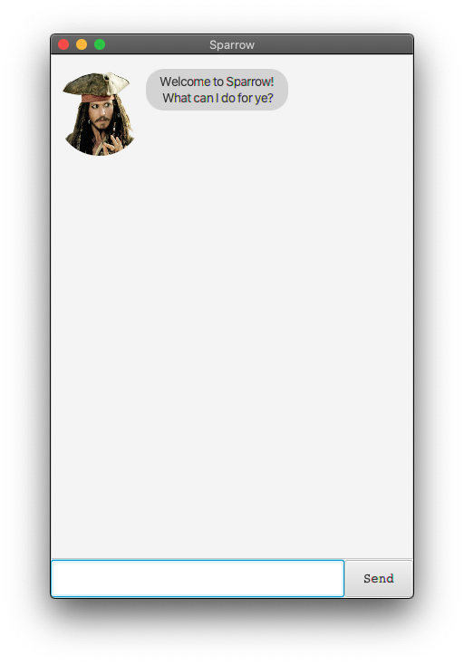

# User Guide

Sparrow is a **desktop app for managing tasks and vocabulary, optimized for use via a Command Line Interface** (CLI) while still having the benefits of a Graphical User Interface (GUI).

- [Quick start](#quick-start)
- [Features](#features)
  * [Viewing help : `help`](#viewing-help)
  * [Adding a task](#adding-a-task)
    + [Adding a Todo : `todo`](#adding-a-todo)
    + [Adding an Event : `event`](#adding-an-event)
    + [Adding a deadline : `deadline`](#adding-a-deadline)
  * [Locating task by name : `find`](#locating-task-by-name)
  * [Marking a task as completed : `done`](#marking-a-task)
  * [Deleting a task : `delete`](#deleting-a-task)
  * [Adding a vocab : `vocab`](#adding-a-vocab)
  * [Defining a word : `define`](#defining-a-word)
  * [Listing all tasks/vocab : `list`](#listing)
  * [Exiting the program : `bye`](#exiting-the-program)
  * [Saving the data](#saving-the-data)
- [Command summary](#command-summary)

--------------------

## Quick start

1. Ensure you have Java `11` or above installed in your computer.
2. Download the latest `Sparrow.jar` from [here](https://github.com/jonfoocy/ip/releases).
3. Copy the file to the folder you want to use as the _home folder_ for Sparrow.
4. Double-click the file to start the app. The GUI similar to the one shown below should appear in a few seconds.

--------------------

## Features
Notes about the command format:
- Words within `< >` are the parameters to be supplied by the user.
e.g. in `todo <DESCRIPTION>`, `DESCRIPTION` is a parameter to be supplied as `todo buy monkey`

### Viewing help : `help`
Shows a message explaining how to access the help page.

Format: `help`

### Adding a task
3 kinds of tasks can be added: Todo, Event, Deadline.

#### Adding a Todo : `todo`
Adds a todo to the task list.

Format: `todo <DESCRIPTION>`

Examples: 
- `todo Find crew for ship`
- `todo find out where all the rum has gone to`

#### Adding an Event : `event`
Adds an event to the task list. An event must contain the event date.

Format: `event <DESCRIPTION> /at <DATE>`

Note the `/at` and date format `YYYY-MM-DD`.

Examples: 
- `event Attend Brethren Court meeting /at 2020-10-31`
- `event Rum deal /at 2020-09-25`

#### Adding a deadline : `deadline`
Adds a deadline to the task list. A deadline must contain a due date.

Format: `deadline <DESCRIPTION> /by <DATE>`

Note the `/by` and date format `YYYY-MM-DD`.

Examples: 
- `deadline Find fountain of youth /by 2020-12-31`
- `deadline Repay debt to Davy Jones /by 2015-12-31`

### Locating task by name : `find`
Searches task list for tasks containing the given keyword.

Format: `find <KEYWORD>`

Example: `find rum`

### Marking a task as completed : `done`
Marks a task as done. Task number corresponds to the latest view of the task list.

Format: `done <TASK NUMBER>`

Example: `done 2`

### Deleting a task : `delete`
Deletes a task from the task list. Task number corresponds to the latest view of the task list.

Format: `delete <TASK NUMBER>`

Example: `delete 1`

### Adding a vocab : `vocab`
Adds a word to the vocabulary list. Accompanying definition is optional.

Format: `vocab <WORD> <DEFINITION>`

Examples:
- `vocab pirate`
- `vocab rum an alcholic spirit distilled from sugar-cane residues or molasses`

### Defining a word : `define`
Returns definition of a word in the vocab list.

Format: `define <WORD>`

Example: `define rum`

### Listing all tasks/vocab : `list`
Displays all tasks/vocab (depending on argument specified).

Format: `list <CATEGORY>`

Examples:
- `list tasks`
- `list vocab
`

### Exiting the program : `bye`
Exits the program.

Format: `bye`

### Saving the data
Sparrow data will be saved in the hard disk automatically after any command that changes the data. There is no need to save manually.

--------------------

## Command summary

Action           | Format, Examples
---------------- | ----------------------------------------------------------------------------------------------
Add todo         | `todo <DESCRIPTION>`   e.g., `todo buy ship`
Add event        | `event <DESCRIPTION> /at <DATE>`   e.g., `event Appointment with the gallows /at 2003-06-28`
Add deadline     | `deadline <DESCRIPTION> /by <DATE>`   e.g., `deadline finalize plan /by 2020-09-30`
Add vocab        | `vocab <WORD> <DEFINITION>`   e.g., `vocab buccaneer a pirate`
Done             | `done <TASK NUMBER>`   e.g., `done 2`
Delete           | `delete <TASK NUMBER>`   e.g., `delete 1`
Find             | `find <KEYWORD>`   e.g., `find ship`
List tasks/vocab | `list <CATEGORY>`   e.g., `list tasks` or `list vocab`
Help             | help
